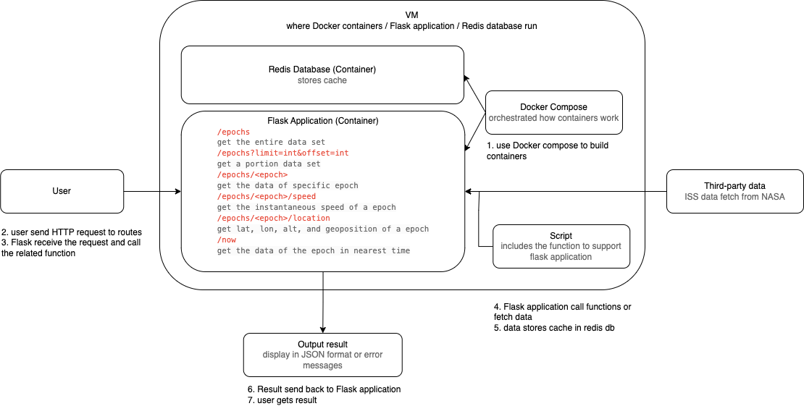

# The Sands of Midterm - ISS Tracker

This Flask-based API provides access to real-time International Space Station (ISS) position data, parsed from NASA's public XML feed. The API allows querying:

- Retrieve entire ISS data
- Retrieve data for a specific epoch
- Calculate instantaneous speed of a a specific epoch
- Get the latitude, longitude, altitude, and geoposition for a specific epoch
- Get the closest epoch to the current time

## Project Structure

- `iss_tracker.py`: Reads the XML file and prints summary statistics of the input file.
- `test_iss_tracker.py`: Tests for functions in the main script.
- `Dockerfile`: Docker configuration file for containerization.
- `docker-compose.yml`: Configuration file that defines and runs multi-container Docker applications, including the Flask API and Redis service.
- `requirements.txt`: List of Python dependencies.

## Data Source

The dataset contains state vectors describing the ISS's position {X, Y, Z} and velocity {X_DOT, Y_DOT, Z_DOT} over a 15-day period. These vectors use the J2000 reference frame, with Earth as the reference point. The ISS data set is retrieved in real-time from NASA's website. Get the dataset here:

[International Space Station](https://spotthestation.nasa.gov/trajectory_data.cfm)

## Run Scripts

1. Clone the repository
```
git clone https://github.com/Jasmineeds/iss-tracker-flask.git
```

2. Navigate to the directory
```
cd iss-tracker-flask
```

3. Build the Containers
```
docker-compose up --build
```

The server will start in debug mode on ```https://localhost:5000```.

## API Endpoints

### Get All Epochs

```
GET /epochs
```

Returns the entire dataset of state vectors for all available time epochs.

**Response Format:**
```json
[
  {
    "EPOCH": "2023-048T12:00:00.000Z",
    "X": 2345.67,
    "Y": 3456.78,
    "Z": 4567.89,
    "X_DOT": 5.67,
    "Y_DOT": 6.78,
    "Z_DOT": 7.89
  },
  ...
]
```

### Get Epochs with Pagination

```
GET /epochs?limit=<int>&offset=<int>
```

Returns a subset of the epochs data with pagination support.

**Query Parameters:**
- `limit` (optional): Number of records to return (default: 5)
- `offset` (optional): Number of records to skip (default: 0)

**Example:**
```
GET /epochs?limit=10&offset=5
```

### Get State Vector for a Specific Epoch

```
GET /epochs/<epoch>
```

Returns the state vector for a specific epoch.

**Example:**
```
GET /epochs/2023-048T12:00:00.000Z
```

**Response Format:**
```json
[
  {
    "EPOCH": "2023-048T12:00:00.000Z",
    "X": 2345.67,
    "Y": 3456.78,
    "Z": 4567.89,
    "X_DOT": 5.67,
    "Y_DOT": 6.78,
    "Z_DOT": 7.89
  }
]
```

### Get Instantaneous Speed for a Specific Epoch

```
GET /epochs/<epoch>/speed
```

Returns the instantaneous speed of the ISS at a specific epoch.

**Example:**
```
GET /epochs/2023-048T12:00:00.000Z/speed
```

**Response Format:**
```json
{
  "instantaneous_speed": 7.82
}
```

### Get Instantaneous Speed for a Specific Epoch

```
GET /epochs/<epoch>/location
```

Returns the latitude, longitude, altitude, and geoposition of a given epoch.

**Example:**
```
GET /epochs/2023-048T12:00:00.000Z/location
```

**Response Format:**
```json
{
  "instantaneous_speed": 7.82
}
```

### Get Current ISS Data

```
GET /now
```

Returns the state vector and instantaneous speed for the epoch that is nearest to the current time.

**Response Format:**
```json
{
  "EPOCH": "2023-048T12:00:00.000Z",
  "X": 2345.67,
  "Y": 3456.78,
  "Z": 4567.89,
  "X_DOT": 5.67,
  "Y_DOT": 6.78,
  "Z_DOT": 7.89,
  "instantaneous_speed": 7.82
}
```

## Software Diagram
The diagram below illustrates the key components and data flow of the ISS Tracker:

- **User Requests:** Clients interact with the system by sending API requests to the Flask server.
- **NASA APIs:** Third-party data sources providing ISS trajectory data.
- **Flask APIs:** The logic that processes requests and retrieves ISS data.
- **Redis Database:** Caches ISS trajectory data to improve response times and reduce external API calls.
- **Docker Containers:** The Flask API and Redis database run within Docker containers, ensuring portability and simplified deployment.



## Note on Using AI
I used AI to understand the following things:

- Optimized docker-compose.yml
- Diagnosed Redis connection issues and improved caching logic
- Ensured correct data flow between Flask, Redis, and external APIs.